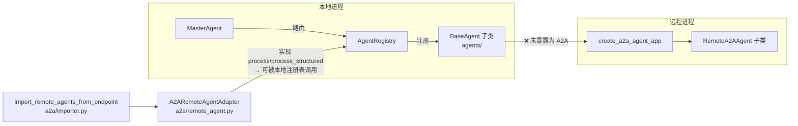
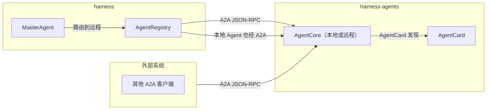

# Agent 统一化与 A2A 化架构设计方案

> 目标：把 Harness 内所有 Agent 统一迁移到一个独立工程，向上抽取一层通用 Agent 核心，
> 标准化 Agent 实现架构；不同 Agent 可基于不同协议/框架（LangGraph、AutoGen、自研 ReAct 等）
> 实现，但**统一通过 A2A 暴露服务**。

## 1. 结论先行

**完全可行，且当前工程已具备约 40% 的脚手架。** 这不是推倒重来，而是把已有的两套 Agent 世界
"接成一张网"、并把协议层抽象出来。核心难点不在技术，而在**契约统一**（AgentCard 作为唯一
能力声明）与**跨进程能力模型**（本地 mixin 能力 vs 远程 A2A 能力的等价映射）。

---

## 2. 现状分析

### 2.1 当前存在"两个 Agent 世界"，未打通

| 世界 | 抽象 | 位置 | 特点 |
| --- | --- | --- | --- |
| **本地富 Agent** | `BaseAgent`（6 mixin + PLAN/REACT/HYBRID） | `core/agent.py`、`agents/` | 能力强（memory/knowledge/tools/vector/audit），**未暴露为 A2A** |
| **远程 A2A 示例 Agent** | `RemoteA2AAgent`（ABC） | `a2a/server.py`、`a2a/example_agents.py` | 已 A2A 暴露，但示例都是**硬编码桩**，非 `agents/` 同款能力 |

### 2.2 已有的桥接（单向、不完整）



- **已具备**：`AgentCard`（模型 `models/a2a.py`）、JSON-RPC 服务（`agent.discover/invoke/status`）、
  `A2ARemoteAgentAdapter`（把远程 A2A Agent 包装成本地 `process/process_structured` 接口）、
  远端导入器（自动拉取 AgentCard 注册进本地 `AgentRegistry`）。
- **缺口**：
  1. 本地 `BaseAgent` 无法被外部系统以 A2A 调用（缺"本地→A2A"方向的桥）。
  2. 远程 `RemoteA2AAgent` 没有 capability 能力（memory/knowledge/tools/audit），只有 `invoke`。
  3. **无协议适配层**：仅 `langgraph_enabled` 标记 + LangGraph 塞进 Temporal Activity（`temporal/agent_activity.py`），
     无 AutoGen、无统一协议抽象。
  4. `agents/` 的富 Agent 与 `a2a/example_agents.py` 的 A2A Agent 是**两套重复实现**，能力不统一。

---

## 3. 目标架构

### 3.1 顶层形态

```mermaid
flowchart TB
    subgraph New["新工程 harness-agents（独立部署）"]
        subgraph Core["Agent Core（通用层）"]
            Lifecycle["AgentLifecycle<br/>before/process/after/error/resume"]
            Context["ExecutionContext<br/>trace/session/actor"]
            Capabilities["CapabilityProvider<br/>memory · knowledge · tools · vector · audit"]
            Artifacts["ArtifactProducer<br/>结构化产物"]
            Registry["AgentRegistry + AgentCard"]
        end
        A1["Agent A（LangGraph）"]
        A2["Agent B（AutoGen）"]
        A3["Agent C（自研 ReAct）"]
        A1 -->|实现| Core
        A2 -->|实现| Core
        A3 -->|实现| Core
    end

    subgraph Harness["现有 harness 工程"]
        API["Harness API"]
        Master["MasterAgent"]
        Wf["WorkflowService / Temporal"]
        Exec["执行层"]
    end

    subgraph Protocol["协议适配层"]
        AdapterL["LangGraphAdapter"]
        AdapterA["AutoGenAdapter"]
        AdapterC["自研 Adapter"]
        AdapterA2A["A2A Bridge（双向）"]
    end

    A1 --> AdapterL
    A2 --> AdapterA
    A3 --> AdapterC
    AdapterL --> AdapterA2A
    AdapterA --> AdapterA2A
    AdapterC --> AdapterA2A
    AdapterA2A -->|"A2A JSON-RPC"| API
    Master -->|"路由到远程 Agent"| API
    Master -->|"本地 Agent 也走 A2A"| AdapterA2A
```



### 3.2 核心概念：Common Agent 契约

所有 Agent（无论底层框架）只实现一个纯函数式契约，其余通用逻辑全部在 Core 层：

```python
# 目标契约（伪代码）
class AgentCore:
    """通用层：所有 Agent 共享的生命周期与能力，不关心底层框架。"""
    async def run(self, request: AgentRequest) -> AgentOutcome:
        # 统一：审计入站、解析身份、注入上下文、能力装配
        # 委托给协议层实现（LangGraph/AutoGen/ReAct）
        result = await self.runtime.execute(request)   # 协议层唯一入口
        # 统一：审计出站、产物持久化、错误归一化
        return outcome

class AgentRuntime(Protocol):
    """协议适配层：把不同框架收敛成同一执行入口。"""
    async def execute(self, request: AgentRequest) -> AgentRuntimeResult: ...
```

**契约边界**（谁拥有什么）：

| 关注点 | 归属 | 说明 |
| --- | --- | --- |
| 生命周期/审计/错误 | **Core** | 所有 Agent 统一 |
| 上下文/身份/trace | **Core** | 通过 `ExecutionContext` |
| memory/knowledge/tools/vector | **Core**（CapabilityProvider） | 通过协议层注入执行 |
| 执行编排（graph/群体/循环） | **协议层** | LangGraph 用 StateGraph，AutoGen 用 GroupChat，自研用 ReAct |
| 产物/制品 | **Core**（ArtifactProducer） | 统一结构 |
| 能力声明 | **Core**（AgentCard） | 唯一真源 |

### 3.3 协议适配层（ProtocolAdapter）

```python
class ProtocolAdapter(ABC):
    kind: str  # "langgraph" | "autogen" | "react" | ...

    @abstractmethod
    async def execute(self, request: AgentRequest, ctx: ExecutionContext) -> AgentRuntimeResult:
        """把 AgentRequest 交给所选框架执行，返回统一结果。"""
```

- **LangGraphAdapter**：`StateGraph` 内 `execute`，把 `AgentRequest` 映射为 graph 初始状态。
- **AutoGenAdapter**：`GroupChat` / `ConversableAgent` 内 `execute`，把 A2A 消息映射为 AutoGen 会话。
- **自研 Adapter**：迁移现有 `BaseAgent` 的 PLAN/REACT/HYBRID 为其中之一。

### 3.4 A2A 作为唯一传输（双向桥）



- **本地→A2A**：把 `AgentCore` 包装成 `RemoteA2AAgent` 形式（复用 `create_a2a_agent_app`），任意本地 Agent 即时可被外部 A2A 调用。
- **远程→本地**：复用现有 `A2ARemoteAgentAdapter` + `import_remote_agents_from_endpoint`，远程 Agent 自动进本地注册表。
- **统一**：Master 路由看到的都是"实现了 `process/process_structured` 的对象"，不再区分本地/远程/框架。

---

## 4. 迁移路径

### Phase 1：抽取 Agent Core（新工程，纯新增，不动现有）
- 新建 `harness-agents` 工程（或 `harness/agents_core` 包），定义 `AgentCore`、`AgentRuntime`、`CapabilityProvider`、`ArtifactProducer`、`AgentCard`。
- 把现有 `BaseAgent` 的 6 个 mixin 的能力**下沉**为 `CapabilityProvider`（不搬逻辑，只重构接口）。

### Phase 2：A2A 双向桥
- 新增"本地 Agent → A2A"包装器，让 `BaseAgent` 子类可被 `create_a2a_agent_app` 暴露。
- 用现有 `import_remote_agents_from_endpoint` 打通远程导入。
- 此时 Master 路由已统一看到 A2A 化的 Agent。

### Phase 3：协议适配
- 把现有 `BaseAgent` 的 PLAN/REACT/HYBRID 收敛为一个 `ReActAdapter`。
- 接入 LangGraph：把 `temporal/agent_activity.py` 里的 LangGraph 逻辑抽成 `LangGraphAdapter`。
- 接入 AutoGen（可选，按需）。

### Phase 4：迁移现有 `agents/`
- 逐个把 `agents/` 的富 Agent 迁移为 `AgentCore` + 协议适配器实现。
- 删除旧 `a2a/example_agents.py` 硬编码桩，改为真实 Agent 的 A2A 暴露。
- 双轨运行：旧调用路径与新 A2A 路径并存，观察后切换。

### Phase 5：收敛
- `legacy_resume_worker` 与旧路由逐步下线，Agent 全部由 A2A 层驱动。

---

## 5. 风险与权衡

| 风险 | 说明 | 缓解 |
| --- | --- | --- |
| **能力等价映射** | 远程 Agent 没有本地 mixin 能力（memory/knowledge/tools），`AgentCard` 需精确声明能力，否则调用方误判 | `AgentCard.capabilities` 强制声明 input/output schema；跨进程能力走 `CapabilityProvider` 注入 |
| **跨进程上下文** | trace/session/actor 需跨 A2A 边界透传 | A2A 请求头透传 `X-Trace-ID`/`X-Session-ID`，复用 `ExecutionContext` |
| **产物一致性** | 本地 Agent 用 `ArtifactDraft`/`ArtifactVersionRef`，远程 A2A 只有 `Artifact` dict | 统一 `ArtifactProducer` 契约，A2A 层序列化/反序列化 |
| **审计完整性** | 远程 Agent 的审计需穿透到 harness 审计链 | 远程 Agent 也实现 `AuditSink`，或 A2A 桥记录入站/出站审计 |
| **性能/延迟** | 本地 Agent 走 A2A 引入序列化开销 | 本地 Agent 可走进程内 A2A（内存桥），远程再走 HTTP |
| **LangGraph@Temporal 冲突** | LangGraph 不能直接进 Temporal Workflow 代码 | 已正确隔离：LangGraph 只在 Activity 内执行（现有 `agent_activity.py` 已示范） |

---

## 6. 落地建议

**推荐：先做 Phase 1 + 2（抽取 Core + A2A 双向桥）**，这是收益最大、风险最低的第一步：
- 新工程 `harness-agents` 落地 `AgentCore`，把现有 `BaseAgent` 的 6 个 mixin 重构为 `CapabilityProvider`。
- 加一个"本地 Agent → A2A"包装器，立即让 `agents/` 的富 Agent 可被外部 A2A 调用。
- 复用现有导入器，Master 路由统一。

**Phase 3（LangGraph/AutoGen 适配）** 在 Core 稳定后按需接入，LangGraph 已有 `temporal/agent_activity.py` 基础，成本可控。

**不建议**：推翻现有 `BaseAgent` 的 ReAct/Plan 实现。把它收敛为一个 `ReActAdapter` 即可，保留已有能力与测试。

---

## 7. 关键文件对照

| 现状 | 目标 |
| --- | --- |
| `core/agent.py`（BaseAgent + 6 mixin） | `AgentCore` + `CapabilityProvider` + `ReActAdapter` |
| `agents/*.py`（富 Agent 子类） | 迁移为 `AgentCore` + 协议适配器 |
| `a2a/server.py`（RemoteA2AAgent + 服务） | 复用为 A2A 传输层 |
| `a2a/remote_agent.py`（远程→本地适配器） | 保留，作为 A2A 桥一半 |
| `a2a/example_agents.py`（硬编码桩） | 删除，替换为真实 Agent 的 A2A 暴露 |
| `temporal/agent_activity.py`（LangGraph in Activity） | 抽为 `LangGraphAdapter` |
| `models/a2a.py`（AgentCard/JSON-RPC 模型） | 保留，作为唯一契约 |
| `core/master.py`（路由） | 路由层无感知（统一走 A2A 接口） |