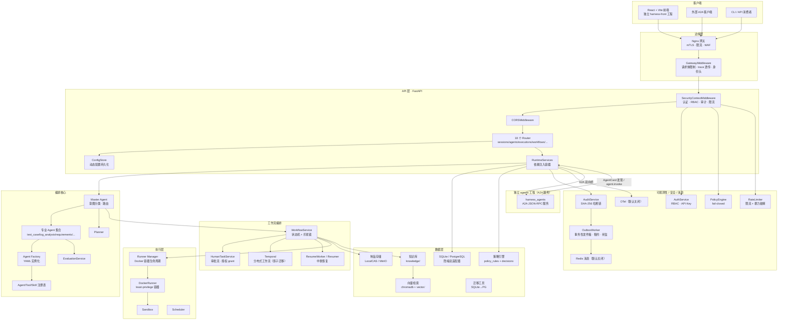
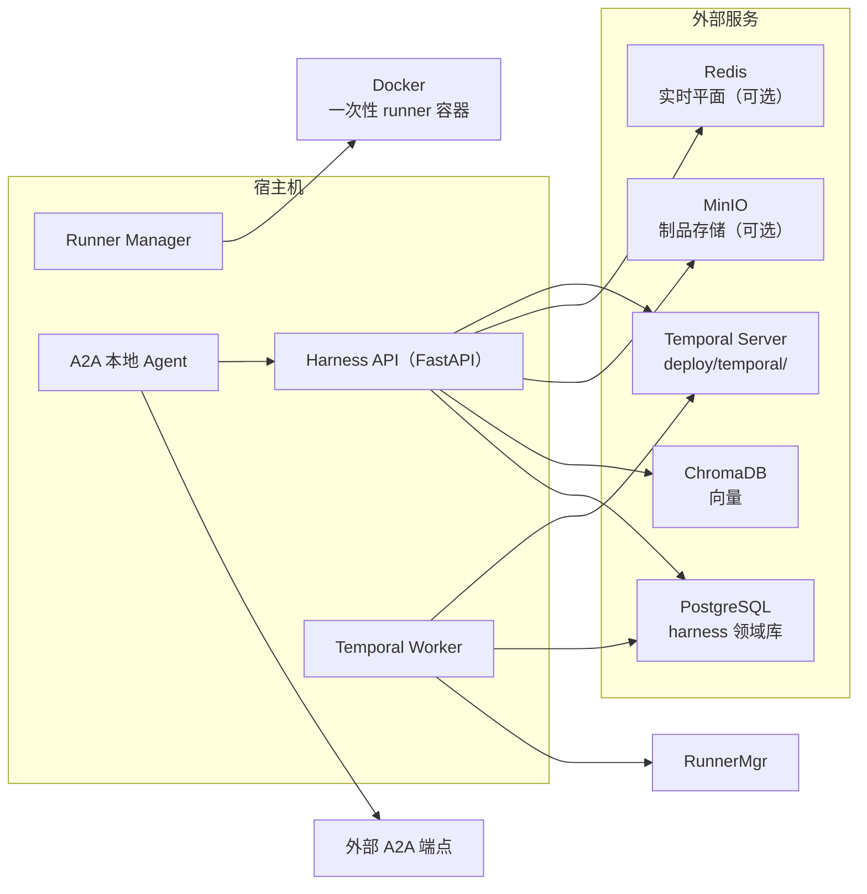
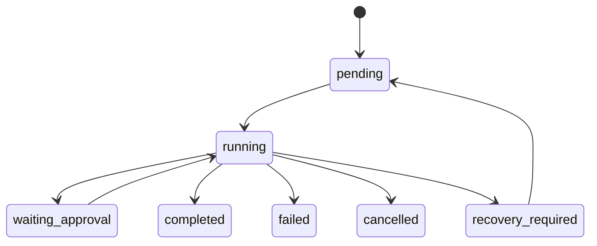
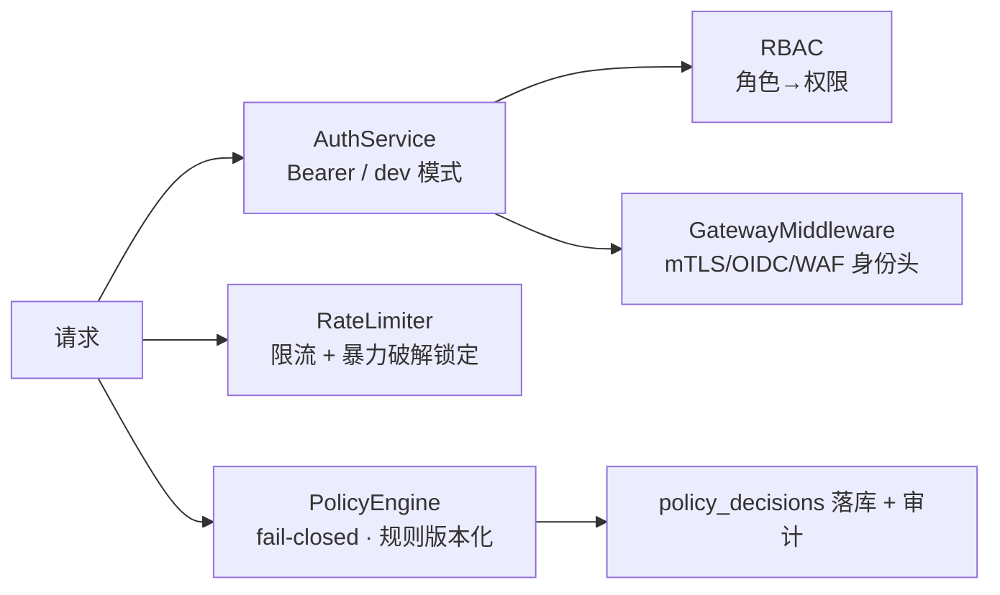
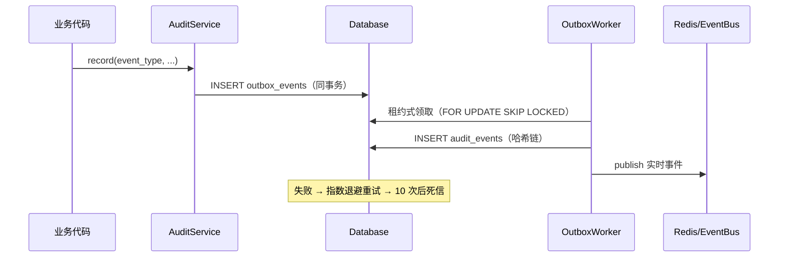
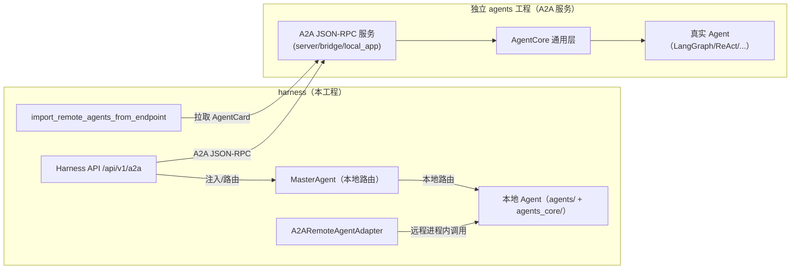
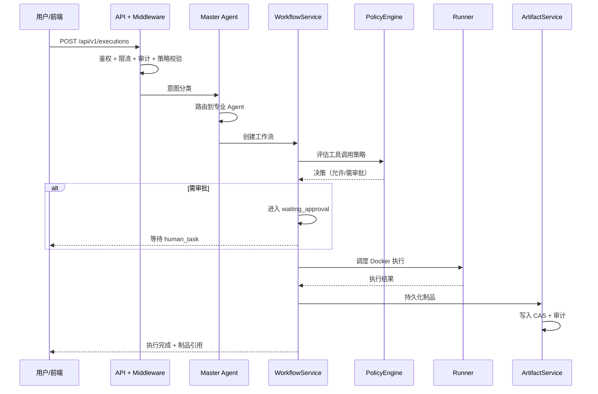

# Harness 架构说明

> 本文档描述 `harness`（AI 测试自动化框架）的当前系统架构。规模：Python 后端 + 真实 React 前端，SQLite↔PostgreSQL 双数据库，含 Temporal 分布式工作流、事务性 Outbox、防篡改审计链等企业级能力。
>
> **2025-08 架构演进**：Agent 侧实现已迁移到独立工程 `agents/`（见 `docs/harness-agents-scaffold.md` 与 `agents/docs/architecture.md`）。harness 保留本地 Agent + A2A 客户端，通过 A2A 与 `agents/` 工程双向互调。

---

## 1. 总览

Harness 是一个 **AI 驱动的测试生命周期管理框架**：接收自然语言需求 → 主 Agent 分类意图 → 路由到专业 Agent → 生成测试用例/脚本 → 在隔离 Docker 容器中执行 → 产出制品并沉淀到知识库。全程可审计、可治理、可恢复。

核心设计原则（来自 `docs/workflow-platform-design.md`）：

- **职责边界清晰**：每个组件只拥有它该拥有的东西（Temporal 管编排与重试，Postgres 管领域数据，Redis 只管实时扇出/缓存/限流）。
- **确定性编排**：LLM / 数据库 / Docker / 网络调用全部隔离为 Activity，工作流只含确定性逻辑。
- **事务性发件箱 + 防篡改审计链**：业务写与事件入队同事务，审计链不可篡改。
- **默认涂掉**：Temporal / OTel / Redis 三项分布式能力默认关闭，需显式开启（影子迁移策略）。

---

## 2. 分层架构

---

## 3. 部署拓扑

- 部署目录：`deploy/`（gateway / runner / runner-manager / temporal 各含 Dockerfile 与 docker-compose）。
- **迁移双轨**：`legacy_resume_worker_enabled`（默认 true）驱动旧调度器；Temporal 作为权威引擎后关闭（`temporal_authoritative_execution`）。

---

## 4. 核心子系统

### 4.1 编排核心（`core/`）

| 组件 | 职责 |
| --- | --- |
| `MasterAgent` | 意图分类 + 路由 + 子 Agent 编排（**组合**而非继承，含 `BaseAgent`） |
| `AgentFactory` | 从 YAML 配置实例化 Agent |
| `AgentRegistry` | Agent / Tool / Skill 注册表 |
| `Planner` | 任务规划 |
| `SessionManager` | 会话生命周期与清理 |
| `EventBus` | 进程内事件总线 |

### 4.2 API 层（`api/`）

- **应用工厂** `create_app()` 组装 FastAPI、中间件、18 个 Router、lifespan 生命周期。
- **中间件顺序**（后加者最外层）：`GatewayMiddleware → SecurityContextMiddleware → CORSMiddleware`，即网关先于鉴权，顺序正确。
- **依赖注入**：`RuntimeServices`（dataclass，7 个可选服务）承载 audit / artifacts / knowledge / policy / workflows / human_tasks 等，API 通过 `Depends` 从 `app.state` 取单例。
- **动态配置** `ConfigStore` 持久化到 DB（LLM 提供商 / MCP server / agent 绑定，`ON CONFLICT DO UPDATE` 原子 upsert）。

### 4.3 工作流编排（`workflow/` + `temporal/`）

- `WorkflowService`：显式状态机 + `UPDATE ... WHERE state=?` 乐观锁 + `version` 自增，SQLite 用 `BEGIN IMMEDIATE` 保证并发安全。
- `HumanTaskService`：审批流（请求者不能审批自己、双人审批、`validate_and_consume_grant` 防并发双消费、claim 租约过期）。
- `RecoverInterruptedRuns`：启动时把 `running` 工作流标记为 `recovery_required`。
- **Temporal**（影子迁移）：`ApprovalWorkflow` / `AgentExecutionWorkflow` 真实注册；审批 wait/decision 已通过 `ApprovalActivities` 写真实审计（P1 已修复）。默认关闭。

### 4.4 执行层（`execution/`）

- `DockerRunner`：一次性、least-privilege 容器（非 root、只读根文件系统、`tmpfs`、CPU/内存/PID/网络限制、镜像 digest 白名单）。
- `RunnerManager`：容器生命周期管理，独立进程，仅它持有 Docker socket 能力。
- `Sandbox` / `Scheduler` / `Reporter`。

### 4.5 数据层（`db/` + `artifacts/`）

- **双适配器**：SQLite（`Database`）与 PostgreSQL（`PostgresDatabase`），`_sql()` 双方言切换，Postgres 适配器 `_reject_sqlite_compat` 拒绝 SQLite 语法。
- **迁移链**：`migrate_sqlite.py` / `migration_tool.py`（SQLite→PG，含 39 张表 + `conversation_turns_id_seq` 序列推进，P0 已修复）；`postgres/migrations/` 5 个不可变 SQL 迁移。
- **制品存储**：`LocalCAS`（SHA-256 内容寻址、原子写入、路径穿越防护）↔ `MinIOStorage` 双实现 + `ArtifactMigrator`。
- **表结构**：约 39 张表，外键 / 复合主键 / 唯一约束 / 覆盖索引齐全；审计链、outbox 租约、工作流投影等企业级表。

### 4.6 知识层（`knowledge/` + `vector/`）

- `KnowledgeService`：知识库集合/文档/块/chunk 管理，文档软删除（`deleted_at`）。
- `VectorStore` / `Retriever` / `Embeddings`：基于 ChromaDB 的向量检索。
- `RetrievalAuditEvents` / `ArtifactKnowledgeLinks`：检索审计与制品-知识关联。

### 4.7 安全层（`security/` + `policy/`）

- **AuthService**：RBAC + API Key（SHA-256 哈希存储）、`secrets.token_urlsafe` 生成；dev 模式默认隐式管理员（生产环境已禁，P0 校验）。
- **PolicyEngine**：fail-closed 默认拒绝、规则优先级、`fnmatch` 资源模式、风险级别、决策全量落库 + 规则版本化快照。
- **RateLimiter**（P0 新增）：进程内滑动窗口，通用请求预算 + 认证失败锁定。

### 4.8 可观测性（`observability/`）

- **审计链**：`previous_hash | canonical_json` 哈希链，每租户链头 `audit_chain_heads`，`verify_chain()` 可校验。
- **事务性 Outbox**：Postgres 用 `FOR UPDATE SKIP LOCKED` + `RETURNING`，SQLite 用乐观 rowcount；指数退避 + 死信。
- **OTel**：真实接入（`FastAPIInstrumentor`），默认关闭。

### 4.9 消息层（`messaging/`）

- `RedisEventPublisher`：`SET NX` 幂等去重 + 失败回滚去重键。
- `RedisStreamConsumer`：消费者组、pending `xclaim` 认领、指数退避重试、DLQ（`harness:events:dlq`）。
- `redis_dlq.py`：DLQ 回放 CLI。
- `broker.py`：进程内异步总线（asyncio.Queue，非分布式）。

### 4.10 Agent 与 A2A（独立 `agents` 工程）

- **双向桥**：`a2a/bridge.py` 的 `LocalAgentA2ABridge` 把本地 Agent 暴露为 A2A；`a2a/remote_agent.py` + `a2a/importer.py` 把远程 A2A Agent 拉进本地 `AgentRegistry`。
- **独立工程**：Agent 侧实现（`agents_core`、`agents`、A2A 服务层）已迁移到 `../agents`（包 `harness_agents`），harness 通过 A2A 消费。
- **统一契约**：`AgentCard` + `agent.invoke` JSON-RPC 为唯一能力声明与调用方式。

---

## 5. 请求生命周期（示例：一次测试任务）

---

## 6. 技术栈

| 领域 | 技术 |
| --- | --- |
| 语言 / 运行时 | Python ≥3.11, asyncio |
| Web 框架 | FastAPI, uvicorn, pydantic v2, pydantic-settings |
| 前端 | React 18, Vite, TypeScript, Tailwind, zustand, @xyflow/react, monaco-editor |
| 数据库 | SQLite (aiosqlite), PostgreSQL (asyncpg) |
| 工作流 | Temporal（temporalio, shadow 迁移） |
| 消息 | Redis Streams（可选） |
| 制品存储 | MinIO（可选，默认 LocalCAS） |
| 向量 | ChromaDB, langgraph |
| LLM | anthropic, openai |
| 可观测 | OpenTelemetry, structlog |
| 测试 | pytest, pytest-asyncio |

---

## 7. 当前状态与演进

### 已具备（企业级）
- ✅ 事务性 Outbox + 防篡改审计链
- ✅ RBAC / API Key / fail-closed 策略引擎 / 网关鉴权
- ✅ 显式状态机 + 乐观并发控制 + 审批流
- ✅ 内容寻址制品存储 + 原子写入
- ✅ SQLite↔PostgreSQL 双适配器 + 迁移工具链
- ✅ 限流 / 暴力破解防护（P0 新增）
- ✅ Temporal 审批 Activity 真实审计（P1 新增）
- ✅ **Agent 独立工程化**：Agent 侧实现迁移到 `agents/`，A2A 双向桥打通（本地↔远程互调）

### 待完善（非企业级阻碍，但需关注）
- ⚠️ **三项分布式能力默认关闭**（Temporal / OTel / Redis），需显式启用 + 集成测试。
- ⚠️ **零 lint/type 门禁**：ruff/mypy 配置已加（P1），但既有告警（如 `app.py` 的 `MinIOStorage` 类型不兼容）未清理。
- ⚠️ **非 git 仓库**，无 CI 门禁。
- ⚠️ 工程卫生：根目录 `*.log`、pip 残留文件（`0.30`、`=0.19`）、空目录需清理。
- ⚠️ `recover_interrupted_runs` 无条件标记所有 running 工作流，可能误伤活跃 worker。
- ⚠️ harness 本地仍保留 Agent 实现（`agents/`、`agents_core/`），与独立 `agents/` 工程并存；彻底切换走 A2A 后可将本地副本收敛。

---

## 8. 关键文件

| 层 | 文件 |
| --- | --- |
| 应用工厂 | `src/harness/api/app.py` |
| 运行时配置 | `src/harness/runtime/settings.py` |
| 依赖注入 | `src/harness/runtime/services.py` |
| 编排核心 | `src/harness/core/master.py` |
| 工作流 | `src/harness/workflow/service.py`, `human_tasks.py` |
| Temporal | `src/harness/temporal/worker.py`, `activities.py` |
| 数据库 | `src/harness/db/database.py`, `postgres.py`, `migration_tool.py` |
| 审计 / Outbox | `src/harness/observability/audit.py`, `outbox.py` |
| 安全 | `src/harness/security/auth.py`, `policy/engine.py`, `ratelimit.py` |
|知识库 | `src/harness/knowledge/service.py`, `vector/` |
| 设计文档 | `docs/workflow-platform-design.md` |