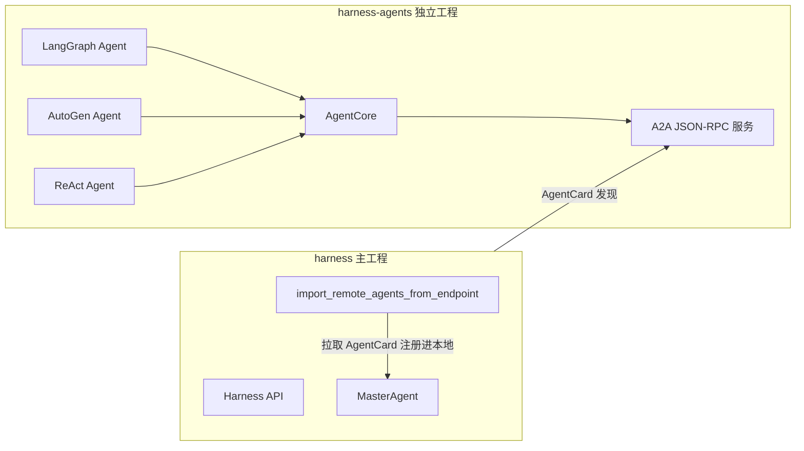

# harness-agents 独立工程脚手架

> 目标：把 Agent 从 `harness` 主工程抽离为独立工程 `harness-agents`，基于相同的 Agent Core 契约，
> 支持 LangGraph / AutoGen / 自研 ReAct 等不同协议实现，**统一通过 A2A 暴露服务**。
>
> 本文档是脚手架蓝图：目录结构 + 核心接口 + LangGraphAdapter 参考实现 + 依赖 + 接入方式。
> 当前工程 `harness` 已按此蓝图落地了 `src/harness/agents_core/` 与 `src/harness/a2a/bridge.py` 作为骨架，
> 本工程可直接复制展开为独立仓库。

---

## 1. 目录结构

```
harness-agents/
├── pyproject.toml
├── README.md
├── src/harness_agents/
│   ├── __init__.py
│   ├── core/                  # 通用层（与 harness.agents_core 对齐）
│   │   ├── contracts.py       # AgentRequest / AgentRuntimeResult / AgentRuntime / AgentCore
│   │   ├── capabilities.py    # CapabilityProvider / NullCapabilities
│   │   └── runtime.py         # ProtocolAdapter 基类 + 框架适配器
│   ├── adapters/
│   │   ├── langgraph.py       # LangGraphAdapter
│   │   ├── autogen.py         # AutoGenAdapter
│   │   └── react.py           # ReActAdapter（自研 Plan/ReAct/Hybrid）
│   ├── a2a/
│   │   ├── server.py          # A2A JSON-RPC 服务 + AgentCard
│   │   └── bridge.py          # 本地→A2A 桥
│   ├── agents/                # 具体 Agent（从 harness 迁移）
│   │   ├── requirements.py
│   │   ├── test_case.py
│   │   ├── script.py
│   │   └── ...
│   └── app.py                 # create_app()：暴露所有 Agent 为 A2A 服务
└── tests/
```

---

## 2. 核心接口（`core/contracts.py`）

与 `harness/agents_core/contracts.py` 完全一致，作为唯一契约：

```python
from dataclasses import dataclass, field
from typing import Protocol, runtime_checkable

@dataclass(frozen=True)
class AgentRequest:
    message: str
    session_id: str
    input_data: dict = field(default_factory=dict)
    trace_id: str | None = None
    idempotency_key: str | None = None

@dataclass(frozen=True)
class AgentRuntimeResult:
    message: str
    status: str = "completed"
    artifacts: list = field(default_factory=list)
    metadata: dict = field(default_factory=dict)

@runtime_checkable
class AgentRuntime(Protocol):
    kind: str
    async def execute(self, request: AgentRequest, ctx) -> AgentRuntimeResult:
        """框架无关的唯一执行入口。"""
        ...

class AgentCore:
    """通用层：生命周期 + 审计 + 上下文 + 产物 + 错误归一化。"""
    def __init__(self, *, agent_id, name, runtime: AgentRuntime,
                 capabilities=None, description="", audit=None): ...
    async def run(self, request: AgentRequest) -> AgentOutcome: ...
```

---

## 3. 协议适配器（`adapters/`）

每个适配器把一种框架收敛到 `AgentRuntime.execute`。下面是 **LangGraphAdapter 参考实现**：

```python
# adapters/langgraph.py
from __future__ import annotations
from typing import Any, Callable

from harness_agents.core.contracts import AgentRequest, AgentRuntimeResult


class LangGraphAdapter:
    """把 LangGraph StateGraph 收敛为 AgentRuntime。"""

    kind = "langgraph"

    def __init__(self, build_graph: Callable[[], Any]) -> None:
        self._build_graph = build_graph

    async def execute(self, request: AgentRequest, ctx) -> AgentRuntimeResult:
        from langgraph.graph import StateGraph  # noqa: F401  lazy import

        graph = self._build_graph()
        state = await graph.ainvoke(
            {"message": request.message, "session_id": request.session_id}
        )
        output = state.get("output") or state.get("message") or ""
        return AgentRuntimeResult(
            message=output,
            status="completed",
            metadata={"framework": "langgraph", "state_keys": sorted(state.keys())},
        )
```

**AutoGenAdapter 骨架**（`adapters/autogen.py`）：

```python
class AutoGenAdapter:
    kind = "autogen"
    def __init__(self, build_agent: Callable[[], Any]) -> None:
        self._build_agent = build_agent
    async def execute(self, request: AgentRequest, ctx) -> AgentRuntimeResult:
        agent = self._build_agent()
        result = await agent.a_initiate_chat(agent=agent, message=request.message)
        return AgentRuntimeResult(
            message=result.chat_history[-1].content if result.chat_history else "",
            status="completed",
            metadata={"framework": "autogen"},
        )
```

**ReActAdapter**：把 `harness` 现有 `BaseAgent` 的 PLAN/REACT/HYBRID 作为 `react` 适配器，
复用 `LocalBaseAgentRuntime`（`harness/agents_core/runtime.py`）。

---

## 4. A2A 暴露（`a2a/bridge.py`）

```python
# a2a/bridge.py
from harness_agents.a2a.server import RemoteA2AAgent, create_a2a_agent_app, completed_result
from harness_agents.core.contracts import AgentCore, AgentRequest


class LocalAgentA2ABridge(RemoteA2AAgent):
    """把任意本地 Agent 暴露为 A2A JSON-RPC 服务。"""

    def __init__(self, agent):
        self._agent = agent
        super().__init__(_card_from_agent(agent))

    async def invoke(self, params):
        if isinstance(self._agent, AgentCore):
            outcome = await self._agent.run(AgentRequest(
                message=params.message, session_id=params.session_id,
                input_data=params.input_data, trace_id=params.trace_id,
            ))
        else:
            outcome = await self._agent.process_structured(params.message, params.session_id)
        return completed_result(params, outcome.message,
                                metadata={"status": outcome.status, **(outcome.metadata or {})})


def create_app(agents):
    return create_a2a_agent_app([LocalAgentA2ABridge(a) for a in agents])
```

---

## 5. 依赖声明（`pyproject.toml`）

```toml
[project]
name = "harness-agents"
requires-python = ">=3.11"
dependencies = [
    "pydantic>=2.0",
    "fastapi>=0.100",
    "uvicorn[standard]>=0.20",
    "anthropic>=0.20",
    "openai>=1.0",
    "langgraph>=0.2",
    "temporalio>=1.8",
]
[project.optional-dependencies]
autogen = ["pyautogen>=0.2"]
dev = ["pytest>=7.0", "pytest-asyncio>=0.21", "ruff>=0.6", "mypy>=1.10"]
```

---

## 6. 与 harness 主工程接入



- **接入点 1（发现）**：harness 启动时调用 `import_remote_agents_from_endpoint` 拉取
  `harness-agents` 的 `/.well-known/agent-cards`，把远程 Agent 注册进本地 `AgentRegistry`。
- **接入点 2（A2A 桥）**：本地 `harness` 也能通过 `harness/a2a/bridge.py` 把自身 Agent 暴露为 A2A，
  与 `harness-agents` 互调，形成双向网。
- **统一契约**：两侧都以 `AgentCard` + `agent.invoke` JSON-RPC 为唯一能力声明与调用方式。

---

## 7. 迁移清单（从 harness 迁入 harness-agents）

1. 复制 `core/`（contracts/capabilities/runtime）与 `a2a/`（server/bridge）→ 已在本工程落地。
2. 把 `harness/agents/*.py` 的富 Agent 改写为 `AgentCore` + 适配器（ReAct/LangGraph）。
   - 最小侵入：用 `harness.agents_core.wrap_base_agent(agent)` 一步把现有
     `BaseAgent` 包装为 `AgentCore`（`LocalBaseAgentRuntime` + 原 mixin 能力），
     再经 `LocalAgentA2ABridge` 暴露为 A2A。已用 `LogAnalystAgent` 实测通过
     （见 `tests/test_agents_migration.py`）。
3. 删除 `harness/a2a/example_agents.py` 硬编码桩，替换为真实 Agent 的 A2A 暴露。
4. 移植 `harness/llm/`（router/factory）与 `harness/observability/audit.py` 为依赖。
5. 双轨运行：harness 通过 `harness-agents` 的 A2A 端点调用 Agent，观察后切换。