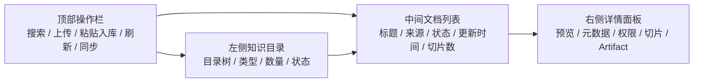

# 企业级知识库 UI 布局改造需求文档

## 1. 文档信息

| 字段 | 内容 |
| --- | --- |
| 文档名称 | 企业级知识库 UI 布局改造需求 |
| 版本 | v0.1 |
| 状态 | 待评审 |
| 编写日期 | 2026-07-30 |
| 适用系统 | Harness Agent 平台 |
| 适用模块 | 企业知识库、Agent Knowledge Profile、Artifact 知识回写 |

## 2. 背景

当前平台已具备企业级知识库后端主干，包括默认知识目录、文档入库、知识检索、Agent Knowledge Profile、Artifact 回写和检索审计。

前端知识库页面目前采用“目录 + 搜索 + 上传区域 + 搜索结果”的单页纵向布局。该布局适合 MVP 验证，但在企业级知识管理场景下存在以下问题：

1. 用户无法直接看到某个知识目录下已有多少文档。
2. 上传区域长期占据主工作区，影响知识资产浏览。
3. 搜索结果和文档资产管理混在一起，信息层级不清晰。
4. 缺少文档详情、切片预览、来源 URI、Artifact 关联、权限标签等企业级信息。
5. 缺少对 Agent 使用知识库的可视化入口，例如某 Agent 可以访问哪些目录。

因此，需要将知识库页面升级为更符合企业后台使用习惯的“三栏控制台式布局”。

## 3. 改造目标

1. 用户进入知识库页面后，应立即看到默认企业知识目录。
2. 用户选择目录后，应看到该目录下的文档列表，而不是只看到搜索结果。
3. 用户点击文档后，应在详情面板查看元数据、来源、内容预览、切片信息和 Artifact 关联。
4. 上传和粘贴入库应作为顶部操作或抽屉弹窗，不应长期占据主内容区。
5. 搜索应支持当前目录内搜索，并保留全局搜索扩展空间。
6. 页面应支持后续扩展权限配置、外部知识源同步、索引状态、版本管理和审计查看。

## 4. 目标用户

| 用户角色 | 主要诉求 |
| --- | --- |
| 测试工程师 | 上传需求、测试策略、用例和测试数据，快速检索复用 |
| 运维工程师 | 管理 Runbook、日志样本、故障复盘和诊断资料 |
| Agent 开发者 | 配置 Agent 可访问知识目录，验证检索效果 |
| 平台管理员 | 管理知识目录、权限、索引状态和数据质量 |
| 审计人员 | 查看知识来源、引用链、检索记录和 Artifact 关联 |

## 5. 推荐布局

页面应采用三栏控制台式布局：

## 6. 页面区域需求

### 6.1 顶部操作栏

顶部操作栏应包含：

1. 页面标题：企业知识库。
2. 当前目录搜索框。
3. 上传文档按钮。
4. 粘贴入库按钮。
5. 刷新按钮。
6. 后续预留：同步外部知识源、查看索引任务、查看检索审计。

### 6.2 左侧知识目录

左侧应固定展示知识目录列表。

默认目录包括：

| 目录标识 | 中文名称 | 说明 |
| --- | --- | --- |
| requirements | 需求知识 | PRD、用户故事、验收标准、业务规则 |
| architecture | 架构知识 | 架构图、ADR、接口设计、链路说明 |
| api_specs | 接口契约 | OpenAPI、Proto、Postman、Mock 契约 |
| test_assets | 测试资产 | 测试策略、用例、测试数据、覆盖矩阵 |
| automation_code | 自动化代码 | 脚本模板、PageObject、框架规范 |
| runbooks | 运维手册 | SOP、发布回滚、故障处理手册 |
| observability | 可观测数据 | 日志、Trace、Metrics、告警样本 |
| incidents | 故障复盘 | 历史缺陷、事故复盘、根因记录 |
| agent_artifacts | Agent 产物 | 需求拆解、测试策略、用例、脚本、执行报告、诊断报告 |

目录卡片应展示：

1. 中文名称。
2. 目录标识。
3. 简短说明。
4. 文档数量。
5. 索引状态，当前阶段可先显示为“可用”。

### 6.3 中间文档列表

选择目录后，中间区域应展示该目录下的文档列表。

文档列表字段：

| 字段 | 说明 |
| --- | --- |
| 标题 | 文档标题 |
| 来源类型 | generic、agent_artifact、requirement、runbook、observability 等 |
| 来源 URI | 文件、Confluence、Git、Artifact 或其他来源 |
| 切片数 | 文档切片数量 |
| 更新时间 | 最近入库或更新事件 |
| 状态 | 已索引、待索引、索引失败 |

当前阶段如果后端暂未提供文档列表接口，页面应使用当前目录搜索结果或空态占位，但 UI 结构应先预留文档列表区域。

### 6.4 右侧详情面板

点击文档后，右侧详情面板应展示：

1. 文档标题。
2. 所属目录。
3. 来源 URI。
4. 来源类型。
5. 内容摘要或正文预览。
6. 切片预览。
7. Artifact ID 和 Artifact Version ID。
8. 元数据。
9. ACL 标签。
10. 后续预留：引用链、版本历史、审计记录。

### 6.5 上传文档

上传文档应通过弹窗或右侧抽屉完成。

上传表单字段：

| 字段 | 必填 | 说明 |
| --- | --- | --- |
| 目标目录 | 是 | 默认使用当前选择目录 |
| 文档标题 | 是 | 文档显示名称 |
| 来源 URI | 否 | 外部来源或文件来源 |
| 文件 | 否 | 支持文本类文件上传 |
| 文本内容 | 否 | 可直接粘贴 Markdown、JSON、日志等内容 |
| 元数据 | 否 | JSON 格式扩展信息 |

上传规则：

1. 文件和文本内容至少提供一个。
2. 上传成功后应刷新当前目录文档列表。
3. 上传成功后应提示文档 ID、切片数量和内容摘要校验值。
4. 上传失败时应显示后端错误信息。

### 6.6 搜索能力

搜索应支持：

1. 当前目录内搜索。
2. 清空搜索后恢复文档列表。
3. 显示搜索命中数量。
4. 显示每条结果的 score、来源 URI 和内容片段。
5. 后续预留全局搜索和 Agent Profile 模拟检索。

## 7. Agent 视角需求

知识库 UI 应服务以下 Agent 的知识管理：

| Agent | 主要知识目录 | 典型用途 |
| --- | --- | --- |
| 需求分析 Agent | requirements、architecture、agent_artifacts | 拆解需求、识别验收标准和风险 |
| 测试策略 Agent | requirements、architecture、incidents、agent_artifacts | 生成测试范围、风险矩阵和覆盖策略 |
| 需求转用例 Agent | requirements、test_assets、agent_artifacts | 生成结构化测试用例 |
| 用例转脚本 Agent | api_specs、automation_code、test_assets、agent_artifacts | 生成自动化脚本 |
| 执行测试 Agent | test_assets、runbooks、automation_code | 执行前读取脚本、环境和 Runbook |
| 诊断及日志分析 Agent | observability、incidents、runbooks、agent_artifacts | 分析日志、定位根因、生成修复建议 |
| QA 问答 Agent | requirements、architecture、runbooks、agent_artifacts | 低延迟回答平台、需求、运维类问题 |

## 8. 非功能需求

### 8.1 易用性

1. 页面首次打开应能看到目录，不应出现“知识库为空”的误导。
2. 上传入口应明显，但不应挤占文档浏览主区域。
3. 空目录应显示引导文案，例如“当前目录暂无文档，请上传或粘贴内容”。
4. 错误信息应可读，不能静默失败。

### 8.2 企业级可扩展性

1. UI 结构应为后续文档版本、权限、外部同步、索引任务预留位置。
2. 目录、文档、详情三个区域应解耦，方便后续拆分组件。
3. API client 应封装知识库相关接口，避免页面直接散落 fetch 调用。

### 8.3 审计与追踪

1. 检索请求应由后端记录 retrieval audit。
2. 后续 UI 应支持按 traceId 查看检索来源。
3. Artifact 回写产生的知识文档应能显示 Artifact 关联信息。

## 9. 验收标准

1. 打开知识库页面后，左侧能看到默认 9 个知识目录。
2. 点击任一目录后，中间显示该目录文档列表区域。
3. 页面顶部有上传文档入口。
4. 用户可以通过上传文件或粘贴文本完成入库。
5. 入库成功后页面显示成功提示，并能通过搜索找到上传内容。
6. 搜索结果展示标题、目录、来源、分数和内容片段。
7. 前端 TypeScript 检查通过。
8. 后端知识库接口不出现 500。

## 10. 本期范围

本期优先完成：

1. 将当前上下布局调整为三栏控制台布局。
2. 保留默认 9 个目录展示。
3. 增加顶部上传按钮和上传抽屉/弹窗。
4. 增加中间文档列表区域。
5. 增加右侧详情预览区域。
6. 保留现有入库与搜索能力。

本期暂不实现：

1. 外部知识源自动同步。
2. 文档版本历史。
3. 目录权限配置 UI。
4. 检索审计 UI。
5. pgvector 或 OpenSearch 检索引擎切换。
