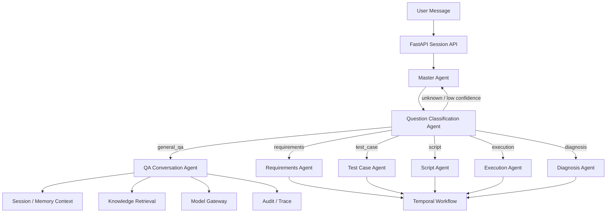

# QA Conversation Agent Requirements

## Background

Harness currently focuses on test-lifecycle automation agents, including
requirements analysis, test case generation, script generation, execution, and
diagnosis. The platform now also needs a general question-answering Agent for
free-form conversations.

The QA Agent should answer open-ended user questions, provide contextual
explanations, and route specialized test automation tasks back into the
existing agent workflow when appropriate.

## Goals

- Add a QA Conversation Agent that supports free-form multi-turn dialogue.
- Let the Master Agent call a remote A2A Question Classification Agent before
  routing.
- Route general Q&A to the QA Agent.
- Route specialized test lifecycle tasks to existing domain agents.
- Support both local Agent and remote A2A Agent deployment models.
- Preserve trace, audit, session context, and RBAC behavior across routing.
- Let operators configure classification routing rules and thresholds through
  the platform UI.

## Non-Goals

- The QA Agent does not execute Docker jobs directly.
- The QA Agent does not bypass policy checks for tools, MCP, or high-risk
  operations.
- The QA Agent does not become the authoritative workflow engine; Temporal
  remains responsible for durable orchestration.
- The QA Agent does not replace the requirements/test/script/execution/diagnosis
  agents.
- The QA Agent synchronous conversation path does not enter Temporal. Long-running
  or high-risk operations should be routed to governed workflows or explicit
  approval paths.

## Review Decisions

| Topic | Decision |
| --- | --- |
| Question Classification Agent | Remote A2A Agent |
| Classification Configuration | Managed through UI with routing rules, thresholds, and target Agent bindings |
| QA Conversation Execution | Synchronous low-latency path; no Temporal workflow for ordinary Q&A |
| Low Confidence Threshold | Recommended default: `0.72` |
| Artifact Persistence | Persist selected QA outputs, not every answer |
| QA Tool Scope | Read-only knowledge access plus governed operations tools |

## Target Routing Flow



## Agent Responsibilities

### Question Classification Agent

The Question Classification Agent determines the routing intent for every user
message before the Master Agent delegates execution. It is deployed as a remote
A2A Agent and configured from the Harness UI.

Required output:

```json
{
  "intent": "general_qa",
  "confidence": 0.91,
  "reasoning": "The user asks for architectural clarification rather than an executable test task.",
  "target_agent_id": "qa_conversation",
  "requires_workflow": false,
  "risk_level": "low"
}
```

Supported intents:

| Intent | Target |
| --- | --- |
| `general_qa` | QA Conversation Agent |
| `requirements` | Requirements Agent |
| `test_case` | Test Case Agent |
| `script` | Script Agent |
| `execution` | Execution Agent |
| `diagnosis` | Diagnosis Agent |
| `unknown` | Master fallback clarification |

Default confidence behavior:

| Confidence | Behavior |
| --- | --- |
| `>= 0.85` | Route directly to target Agent |
| `0.72 - 0.85` | Route if rule match is strong; otherwise ask one clarification |
| `< 0.72` | Do not route; Master asks a clarification question |

The default low-confidence threshold is `0.72`. This is high enough to reduce
misroutes between QA and test-lifecycle agents, but not so high that ordinary
free-form QA is constantly interrupted.

### QA Conversation Agent

The QA Agent answers general questions using session context, configured
knowledge sources, and LLM reasoning.

Responsibilities:

- Answer architecture, usage, design, and troubleshooting questions.
- Ask clarifying questions when intent is ambiguous.
- Reference Harness platform concepts consistently.
- Execute read-only knowledge and operations queries when allowed by RBAC.
- Execute governed operations actions only through policy enforcement, audit,
  and approval when required.
- Avoid high-risk actions unless explicitly routed to a governed workflow or
  approved operation path.
- Return structured metadata describing answer type, confidence, and sources.

Artifact persistence policy:

- Ordinary conversational answers are stored in session history only.
- Important outputs can be persisted as artifacts when the user explicitly asks
  to save them, pins the answer, or the answer is a structured operational
  report.
- Persisted QA artifacts must include source references, trace ID, actor ID, and
  answer metadata.

## A2A Agent Card

```json
{
  "agent_id": "remote.qa_conversation",
  "name": "Remote QA Conversation Agent",
  "version": "1.0.0",
  "description": "Answers free-form Harness platform and test automation questions.",
  "capabilities": [
    {
      "name": "qa.conversation",
      "description": "Answer general user questions with session and knowledge context.",
      "input_schema": {
        "type": "object",
        "required": ["message", "session_id"],
        "properties": {
          "message": {"type": "string"},
          "session_id": {"type": "string"},
          "context": {"type": "object"},
          "sources": {"type": "array"}
        }
      },
      "output_schema": {
        "type": "object",
        "required": ["answer", "confidence", "answer_type"],
        "properties": {
          "answer": {"type": "string"},
          "confidence": {"type": "number"},
          "answer_type": {"type": "string"},
          "sources": {"type": "array"},
          "follow_up_questions": {"type": "array"}
        }
      }
    }
  ],
  "risk_level": "low",
  "protocols": ["a2a-jsonrpc"]
}
```

## Functional Requirements

| ID | Requirement | Priority |
| --- | --- | --- |
| QA-REQ-001 | The Master Agent must call the Question Classification Agent before routing a user message. | High |
| QA-REQ-002 | The classifier must return intent, confidence, target agent, risk level, and reasoning. | High |
| QA-REQ-003 | Messages classified as `general_qa` must route to the QA Conversation Agent. | High |
| QA-REQ-004 | The QA Agent must support local and remote A2A deployment modes. | High |
| QA-REQ-005 | The QA Agent must consume session context and optional knowledge retrieval results. | Medium |
| QA-REQ-006 | The QA Agent must return structured metadata with confidence, answer type, and source references. | Medium |
| QA-REQ-007 | Low-confidence classification must return to Master fallback clarification. | Medium |
| QA-REQ-008 | All classification and QA invocations must emit audit and trace events. | High |
| QA-REQ-009 | The UI must allow configuring classifier endpoint, routing threshold, intent mappings, and target Agent bindings. | High |
| QA-REQ-010 | The QA Agent must support governed operations tools in addition to read-only knowledge retrieval. | High |
| QA-REQ-011 | The QA Agent must persist selected answers as artifacts based on explicit user action or structured report policy. | Medium |

## Non-Functional Requirements

| ID | Requirement | Priority |
| --- | --- | --- |
| QA-NFR-001 | Classification latency should be bounded and observable. | Medium |
| QA-NFR-002 | QA responses should respect RBAC, tenant isolation, and gateway identity context. | High |
| QA-NFR-003 | Remote A2A calls must support timeout, retry, and protocol error handling. | High |
| QA-NFR-004 | QA Agent must not directly execute tools without policy enforcement. | High |
| QA-NFR-005 | QA Agent output must be deterministic enough for contract and regression testing. | Medium |
| QA-NFR-006 | Ordinary QA responses should remain low latency and avoid Temporal workflow startup overhead. | Medium |

## Data Contracts

### Classification Result

```json
{
  "intent": "general_qa",
  "confidence": 0.9,
  "reasoning": "User asks a conceptual platform question.",
  "target_agent_id": "remote.qa_conversation",
  "requires_workflow": false,
  "risk_level": "low"
}
```

### QA Result

```json
{
  "answer": "Temporal is used for durable orchestration, while LangGraph can be used inside run_agent Activity for reasoning flow.",
  "confidence": 0.87,
  "answer_type": "architecture_explanation",
  "sources": [
    {
      "type": "document",
      "ref": "docs/workflow-platform-design.md"
    }
  ],
  "follow_up_questions": []
}
```

## Testing Strategy Requirements

The later Requirements Analysis Agent should generate a detailed test strategy
from this document. At minimum, the strategy must cover:

- Classifier unit tests for all supported intents.
- UI configuration tests for classifier endpoint, threshold, and route bindings.
- A2A contract tests for QA Agent Card, `agent.discover`, `agent.invoke`, and
  `agent.status`.
- Master routing tests for `general_qa`, domain-agent routing, and low-confidence
  fallback.
- Session integration tests proving multi-turn context is preserved.
- Audit and trace tests proving classifier and QA invocations are recorded.
- Timeout/error-path tests for remote A2A QA Agent calls.
- Policy tests for QA operations tools, including allow, approval, deny, and
  audit outcomes.
- Artifact persistence tests for explicit save/pin/report scenarios.
- Regression tests ensuring QA routing does not break existing requirements,
  test-case, script, execution, and diagnosis flows.

## Acceptance Criteria

- A user can ask a general Harness architecture question and receive a QA Agent
  answer.
- A user can ask for test-case generation and the classifier routes away from
  QA to the existing Test Case Agent.
- The classifier runs as a remote A2A Agent and is configurable from the UI.
- The same QA Agent can run as a local Agent or remote A2A Agent.
- A2A discovery exposes the QA Agent Card.
- All responses include traceable metadata.
- Failed or timed-out remote QA calls return controlled protocol errors.
- Ordinary QA conversations return synchronously without creating a Temporal
  workflow.
- Selected QA responses can be persisted as immutable artifacts.
- Governed operations actions pass through policy enforcement and audit.
- Existing full regression suite continues to pass.

## Review Questions

- Which operations tools should QA receive in the first release?
- Which QA answer types should be auto-persisted as artifacts versus session-only?
- Should classifier configuration changes require approval in production mode?
- Should the confidence threshold be globally configured or overridable per
  intent?
