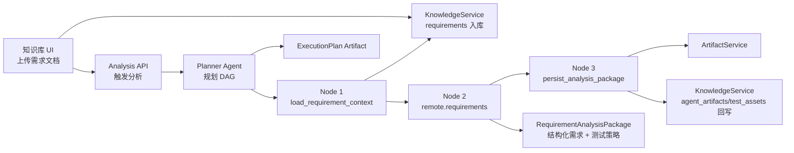
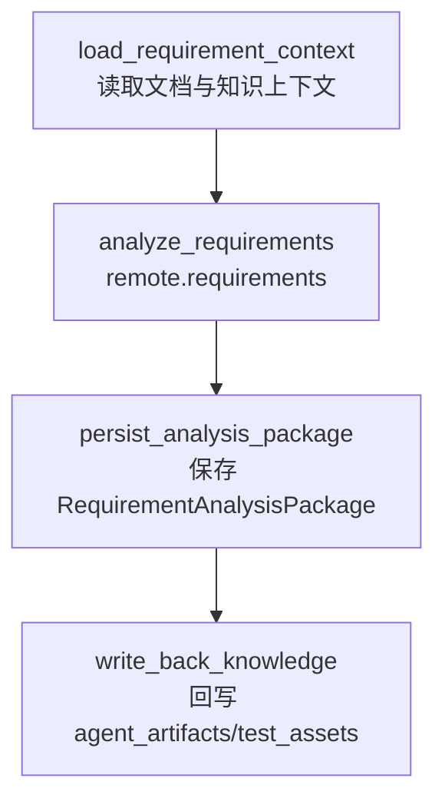
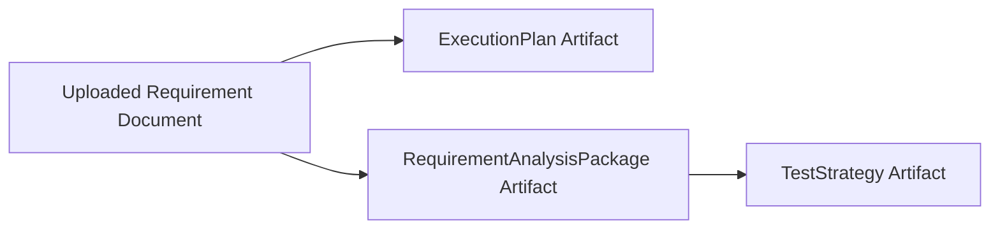

# 需求分析 Agent 设计文档：上传需求文档后由 Planner 规划 DAG 并自动生成测试策略

## 1. 文档信息

| 字段 | 内容 |
| --- | --- |
| 文档名称 | 需求分析 Agent 设计文档 |
| 版本 | v0.1 |
| 状态 | 待评审 |
| 编写日期 | 2026-07-30 |
| 适用系统 | Harness Agent 平台 |
| 相关能力 | 知识库、Planner Agent、远程 A2A Agent、Artifact、测试策略生成 |

## 2. 背景

当前平台已经具备：

1. 企业知识库：支持目录、文档入库、文档列表、详情、检索、软删除。
2. 远程 A2A Agent 框架：支持远程 Agent 注册、发现和调用。
3. 需求分析远程 Agent：当前 `remote.requirements` 可输出 `RequirementAnalysisPackage`。
4. Planner Agent：支持基于目标生成 `ExecutionPlan` DAG，并按依赖执行 Agent 节点。
5. Artifact：支持结构化产物持久化。

用户希望上传一份需求文档后，平台自动完成：

```text
需求文档上传
  -> 知识库入库
  -> Planner Agent 规划 DAG
  -> 需求分析 Agent 拆解需求
  -> 测试策略生成
  -> Artifact 持久化
  -> 回写知识库
```

本设计用于明确需求分析 Agent 的职责边界、输入输出合同、DAG 编排方式、Artifact 策略和后续开发范围。

## 3. 设计目标

1. 用户上传需求文档后，可以触发“自动需求分析与测试策略生成”流程。
2. Planner Agent 负责规划 DAG，不直接执行业务分析逻辑。
3. 需求分析 Agent 负责读取需求文档、检索知识库上下文、输出结构化需求分析包。
4. 测试策略作为 `RequirementAnalysisPackage.test_strategy` 输出，并持久化为 Artifact。
5. 分析结果应回写到知识库，供需求转用例 Agent 后续消费。
6. 全链路具备 traceId、审计、Artifact lineage 和知识库引用。

## 4. 总体架构



## 5. 职责划分

### 5.1 Planner Agent

Planner Agent 负责：

1. 根据用户目标和上传文档信息生成 DAG。
2. 校验 DAG 中的 Agent 是否可用。
3. 输出 `ExecutionPlan` Artifact。
4. 按拓扑顺序执行 DAG 节点。

Planner Agent 不负责：

1. 直接解析需求文档。
2. 直接生成测试策略。
3. 直接写业务数据库。

### 5.2 需求分析 Agent

需求分析 Agent 负责：

1. 读取上传需求文档内容。
2. 根据 Agent Knowledge Profile 检索相关知识。
3. 拆解功能需求、非功能需求、验收标准、假设和风险。
4. 生成测试策略，包括测试级别、准入准出、覆盖目标和回归范围。
5. 输出统一合同 `RequirementAnalysisPackage`。

### 5.3 KnowledgeService

KnowledgeService 负责：

1. 将上传需求文档写入 `requirements` 目录。
2. 为需求分析 Agent 提供上下文检索。
3. 将分析产物回写到 `agent_artifacts`。
4. 可选将测试策略摘要回写到 `test_assets`。
5. 记录检索审计。

### 5.4 ArtifactService

ArtifactService 负责：

1. 保存 Planner 生成的 `ExecutionPlan`。
2. 保存需求分析 Agent 输出的 `RequirementAnalysisPackage`。
3. 可选单独保存 `TestStrategy`。
4. 建立来源文档、分析包、测试策略之间的 lineage。

## 6. 核心流程设计

### 6.1 用户触发流程

用户在知识库页面上传需求文档后，可以点击：

```text
生成测试策略
```

前端调用：

```http
POST /api/v1/requirements/analyze
```

请求示例：

```json
{
  "document_id": "knowledge_document_id",
  "collection_name": "requirements",
  "objective": "分析该需求文档并生成结构化测试策略",
  "planner_enabled": true
}
```

### 6.2 Planner DAG

推荐 DAG：



对应 `ExecutionPlan`：

```json
{
  "schema_version": 1,
  "objective": "分析上传需求文档并生成测试策略",
  "nodes": [
    {
      "id": "load_requirement_context",
      "node_type": "agent",
      "description": "Load uploaded requirement document and retrieve related knowledge context.",
      "depends_on": [],
      "agent_id": "remote.requirements",
      "input_data": {
        "mode": "context_prepare"
      }
    },
    {
      "id": "analyze_requirements",
      "node_type": "agent",
      "description": "Analyze requirement document and generate RequirementAnalysisPackage.",
      "depends_on": ["load_requirement_context"],
      "agent_id": "remote.requirements",
      "input_data": {
        "contract": "RequirementAnalysisPackage"
      }
    }
  ],
  "metadata": {
    "workflow_type": "requirement_analysis_to_test_strategy",
    "persist_artifacts": true
  }
}
```

> 评审建议：当前 `PlanExecutor` 只执行 Agent 节点，暂不支持 Tool 节点。因此第一阶段可以将“上下文准备 + 分析”合并到 `remote.requirements` 一个节点内完成，Artifact 保存和知识回写由 API service 在 DAG 执行后处理。

## 7. 输入输出合同

### 7.1 输入：RequirementAnalysisRequest

建议新增模型：

```json
{
  "document_id": "string",
  "collection_name": "requirements",
  "objective": "string",
  "agent_id": "remote.requirements",
  "planner_enabled": true,
  "persist_artifact": true,
  "write_back_knowledge": true,
  "context_query": "string",
  "extra_context": {}
}
```

字段说明：

| 字段 | 必填 | 说明 |
| --- | --- | --- |
| document_id | 是 | 已上传到知识库的需求文档 ID |
| collection_name | 否 | 默认 `requirements` |
| objective | 否 | 分析目标 |
| agent_id | 否 | 默认 `remote.requirements` |
| planner_enabled | 否 | 是否通过 Planner 生成 DAG |
| persist_artifact | 否 | 是否保存分析结果 |
| write_back_knowledge | 否 | 是否回写知识库 |
| context_query | 否 | 知识库上下文检索 query |
| extra_context | 否 | 额外业务上下文 |

### 7.2 输出：RequirementAnalysisResponse

建议新增响应：

```json
{
  "document_id": "string",
  "plan": {},
  "analysis_package": {},
  "artifacts": {
    "plan_artifact": {},
    "analysis_package_artifact": {},
    "test_strategy_artifact": {}
  },
  "knowledge_write_back": [
    {
      "collection_name": "agent_artifacts",
      "document_id": "string",
      "chunk_count": 1
    }
  ],
  "trace_id": "string"
}
```

### 7.3 Agent 输出合同

需求分析 Agent 必须输出：

```text
RequirementAnalysisPackage
```

该合同包含：

1. `requirement_spec`：功能需求、验收标准、假设、风险。
2. `non_functional_requirements`：安全、性能、可靠性、可观测性等非功能需求。
3. `test_strategy`：测试目标、测试级别、优先级模型、准入准出、覆盖目标、回归范围、自动化策略。
4. `traceability`：需求、风险、测试重点、测试级别映射。
5. `summary`：分析摘要。

## 8. 知识库使用设计

### 8.1 输入文档入库

上传的需求文档应写入：

```text
requirements
```

文档元数据建议包含：

```json
{
  "source": "knowledge_ui",
  "document_type": "requirement",
  "analysis_status": "pending"
}
```

### 8.2 分析上下文检索

需求分析 Agent 的默认 Profile：

```json
{
  "agent_id": "remote.requirements",
  "collections": ["requirements", "architecture", "agent_artifacts"],
  "strategy": "hybrid",
  "limit": 8,
  "require_citations": true,
  "write_back_artifacts": true
}
```

检索策略：

1. 先读取上传文档自身切片。
2. 再基于文档标题和正文摘要检索 `architecture`。
3. 再检索历史 `agent_artifacts` 中的需求分析包或测试策略。
4. 将检索来源写入 `RequirementSpec.references` 或 Artifact metadata。

### 8.3 结果回写

分析结果回写：

| 产物 | Artifact 类型 | 知识目录 |
| --- | --- | --- |
| 完整分析包 | requirement_analysis_package | agent_artifacts |
| 测试策略 | test_strategy | test_assets |

## 9. Artifact 设计

建议生成三个 Artifact：

| Artifact | 类型 | 内容 |
| --- | --- | --- |
| Planner 执行计划 | execution_plan | DAG JSON |
| 需求分析包 | requirement_analysis_package | RequirementAnalysisPackage JSON |
| 测试策略 | test_strategy | TestStrategy JSON |

Lineage 关系：



## 10. API 设计

### 10.1 分析接口

```http
POST /api/v1/requirements/analyze
```

职责：

1. 读取知识库文档。
2. 构造 Planner objective。
3. 调用 Planner 生成或执行 DAG。
4. 调用 `remote.requirements`。
5. 解析 `RequirementAnalysisPackage`。
6. 保存 Artifact。
7. 回写知识库。
8. 返回结果摘要。

### 10.2 查询分析结果

后续可增加：

```http
GET /api/v1/requirements/analysis-runs/{run_id}
```

第一阶段可以不做独立 run 表，直接通过 Artifact 和 traceId 追踪。

## 11. UI 设计

### 11.1 知识库页面入口

当用户选择 `requirements` 目录中的某个文档时，右侧详情面板增加：

```text
生成测试策略
```

按钮规则：

1. 仅 `requirements` 目录文档默认展示。
2. 点击后调用 `/api/v1/requirements/analyze`。
3. 执行中显示 loading 状态。
4. 完成后展示摘要、Artifact ID 和测试策略预览。

### 11.2 Agent 页面入口

Planner Agent 详情页后续可展示：

1. 最近生成的 ExecutionPlan。
2. DAG 节点列表。
3. 节点执行结果。
4. Artifact 链接。

第一阶段不强制实现。

## 12. 错误处理

| 场景 | 处理 |
| --- | --- |
| document_id 不存在 | 返回 404 |
| 文档已删除 | 返回 404 或不可分析 |
| remote.requirements 未注册 | 返回 409，并提示远程 Agent 未接入 |
| Agent 输出不是合法 JSON | 返回 502，并保存原始错误摘要 |
| Artifact 保存失败 | 返回 500，不回写知识库 |
| 知识库回写失败 | 主结果返回成功，但 warnings 中提示回写失败 |

## 13. 审计与可观测性

需要记录：

1. `requirements.analysis.requested`
2. `agent.plan_created`
3. `requirements.analysis.completed`
4. `artifact.created`
5. `knowledge.document.indexed`

Trace 要贯穿：

```text
HTTP request -> Planner -> remote.requirements -> Artifact -> Knowledge write-back
```

## 14. 分阶段开发建议

### Phase 1：最小闭环

1. 新增 `/api/v1/requirements/analyze`。
2. 读取知识库文档详情和切片内容。
3. 调用 `remote.requirements`。
4. 保存 `RequirementAnalysisPackage` Artifact。
5. 单独保存 `TestStrategy` Artifact。
6. 回写 `agent_artifacts` 和 `test_assets`。
7. 知识库 UI 增加“生成测试策略”按钮。

### Phase 2：Planner DAG 显式化

1. 通过 Planner Agent 生成 `ExecutionPlan`。
2. 保存 Plan Artifact。
3. 返回 DAG 节点给 UI 展示。
4. 对 Planner 输出增加固定模板兜底，避免 LLM 不稳定。

### Phase 3：平台化运行记录

1. 新增 `requirement_analysis_runs` 表。
2. 支持查看历史分析记录。
3. 支持失败重试。
4. 支持人工评审测试策略。

### Phase 4：Temporal 化

如果分析流程变长，或需要审批、重试、人工评审，可升级为 Temporal Workflow。

第一阶段不建议进入 Temporal，因为“上传文档 -> 生成策略”属于低风险同步或短异步流程。

## 15. 验收标准

1. 用户上传需求文档后，可以点击“生成测试策略”。
2. 平台能生成结构化 `RequirementAnalysisPackage`。
3. 输出中包含 `test_strategy`。
4. 分析包和测试策略均持久化为 Artifact。
5. 产物能回写知识库，并能被后续检索命中。
6. `remote.requirements` 未启动时，接口返回可理解错误。
7. 相关后端测试通过。
8. 前端 TypeScript 与 Vite build 通过。

## 16. 评审问题

1. 第一阶段是否允许同步执行，还是必须后台异步？
2. 测试策略是否必须单独持久化为 `test_strategy` Artifact？
3. 分析结果是否需要人工确认后再回写 `test_assets`？
4. `remote.requirements` 是否作为唯一需求分析 Agent，还是允许按项目配置不同 Agent？
5. 是否需要将 Planner DAG 可视化作为本期范围？
