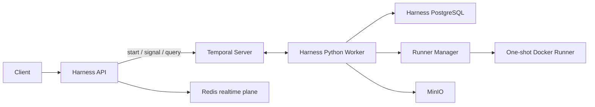

# Harness Workflow Platform Design

## Decision

Harness uses self-hosted Temporal as its durable workflow control plane.
Temporal owns orchestration history, retries, timers, cancellation, and
Signals. PostgreSQL stores Harness domain data, audit data, and artifact
metadata. Redis supports realtime delivery, caching, and rate limits only.



| Component | Owns | Must not own |
| --- | --- | --- |
| Temporal | workflow history, task dispatch, retry, timer, Signal | artifacts and business projection |
| Harness PostgreSQL | policy, audit, artifact metadata, read-model projection | retry scheduling |
| Worker | deterministic Workflow code and Activities | HTTP request lifetime |
| Runner Manager | execution container lifecycle | policy decisions |
| Redis | SSE/WebSocket fan-out, cache, rate limits | workflow state |

## Interface inventory

```python
@dataclass(frozen=True)
class WorkflowInput:
    workflow_id: str
    request_id: str
    actor_id: str
    trace_id: str
    intent: str
    payload_artifact_version_id: str
    policy_snapshot_id: str

@dataclass(frozen=True)
class WorkflowResult:
    workflow_id: str
    state: str
    output_artifact_version_ids: list[str]
    error_code: str | None
```

`HarnessWorkflow` exposes `run(input)`, `status()` Query, and the following
Signals. All Signals include workflow ID, step ID, actor identity, trace ID,
and an idempotency key. A stale Signal is rejected.

| Signal | Contract |
| --- | --- |
| `approve(grant)` | validate an immutable approval grant and unblock that exact step |
| `reject(reason)` | record rejection and transition to `cancelled` |
| `cancel(reason)` | request safe cancellation; Activities honour cancellation |
| `submit_input(input)` | accept a versioned artifact only while awaiting input |

| Activity | Task Queue | Idempotency boundary | Retry policy |
| --- | --- | --- | --- |
| `validate_request` | `orchestration` | request ID | no retry for validation error |
| `plan_agent_task` | `agent-llm` | plan artifact digest | transient provider retry |
| `run_agent` | `agent-llm` | agent output artifact digest | bounded retry and fallback |
| `evaluate_policy` | `orchestration` | policy snapshot plus input digest | database transient retry |
| `execute_runner_job` | `docker-execution` | execution ID | only before container creation |
| `persist_artifacts` | `orchestration` | content digest plus version key | transaction conflict retry |
| `call_mcp_tool` | `mcp` | external idempotency key | idempotent tools only |
| `publish_realtime_event` | `realtime` | event ID | best effort only |

Workflows contain deterministic orchestration only. LLM, database, Docker,
MCP, and network calls are Activities. Activities persist visible output before
acknowledging success and carry workflow/run/activity IDs, attempt, trace ID,
actor ID, and idempotency key.

## Task Queue capacity model

| Queue | Initial replicas | Activities / replica | Initial concurrency | Scale signal |
| --- | ---: | ---: | ---: | --- |
| `orchestration` | 2 | 32 | 64 | schedule-to-start P95 over 5 seconds |
| `agent-llm` | 2 | 8 | 16 | provider latency or budget limit |
| `docker-execution` | 2 | 2 | 4 | runner slots and CPU/memory limit |
| `mcp` | 2 | 4 | 8 | MCP server rate limit |
| `realtime` | 1 | 16 | 16 | Redis consumer lag |

Use `replicas = ceil(required_concurrency / concurrency_per_replica)`. Docker
concurrency is the lower of runner quota and
`floor(host_allocatable_memory / runner_memory_limit)`. Alert if P95
schedule-to-start exceeds its objective for five minutes or a critical queue
has fewer than two available worker replicas. LLM and Runner queues apply
backpressure rather than accept arbitrary API traffic.

## Docker Runner security policy

Runner Manager creates a fresh container per job from an internal image
allowlist referenced by immutable digest. API and Worker processes never receive
Docker socket access; only Runner Manager receives that capability.

| Control | Required policy |
| --- | --- |
| Identity | non-root UID/GID; `no-new-privileges`; drop all Linux capabilities |
| Filesystem | read-only root; `tmpfs` `/tmp`; private size-limited workdir |
| Resources | CPU, memory, PID, disk, wall-time, output-size limits |
| Network | `none` by default; named internal network only if policy allows |
| Secrets | no inherited environment; scoped, short-lived token only if required |
| Images | internal allowlist, digest pinning, SBOM and vulnerability scan gate |
| Egress | proxy or DNS allowlist for approved internal services; no host network |
| Audit | container ID, image digest, policy decision, command digest, limits, exit |
| Cleanup | kill on timeout/cancel, remove container/volume, save logs as artifacts |

Docker is accepted for controlled single-tenant internal code. Untrusted code
or stronger isolation requirements require microVM-based runners.

## Migration from `workflow_runs`

| Existing model | Temporal model | Retained projection |
| --- | --- | --- |
| `workflow_runs.id` | `workflow_id` | legacy-to-Temporal mapping table |
| `trace_id` | workflow memo/search attribute | audit/domain record |
| `state`, `current_step_id` | workflow state plus Query | read-model projection |
| `workflow_steps` | Activity history | immutable step projection |
| `workflow_transitions` | event history | audit records |
| `workflow_checkpoints` | Activity output reference | artifact lineage |
| `human_tasks`, `approval_grants` | wait state plus approval Signal | authorization source |

1. Add `temporal_workflow_id`, `temporal_run_id`, `migration_state`, and a
   unique legacy mapping table; retain current tables.
2. Run Worker in shadow mode with no side effects while legacy execution remains
   authoritative.
3. Route new workflows to Temporal and dual-write a read-model projection to
   the existing workflow tables.
4. Archive terminal legacy runs. Recreate approval waits from their last
   immutable checkpoint. Mark active nonterminal runs `recovery_required` until
   an idempotency review authorizes replay.
5. Compare state, artifacts, policy decision IDs, and audit links; cut read
   traffic to Temporal projection after an observation period.
6. Disable legacy scheduling and ResumeWorker only after all nonterminal legacy
   runs are terminal or migrated; retain legacy data read-only for audit.

Never blindly restart a partially completed non-idempotent execution. Recovery
creates a new execution ID with an explicit decision and linked audit event.

## Review gates

- A worker restart during approval wait retains state and accepts one valid Signal.
- Duplicate Signal, Activity delivery, or Redis event cannot duplicate side effects.
- Runner cannot access host files, Docker socket, inherited secrets, or unapproved network.
- PostgreSQL restore plus Temporal restart recovers a test workflow and audit link.
- Promotion beyond development requires image digests, backups, TLS, secrets, and monitoring.
